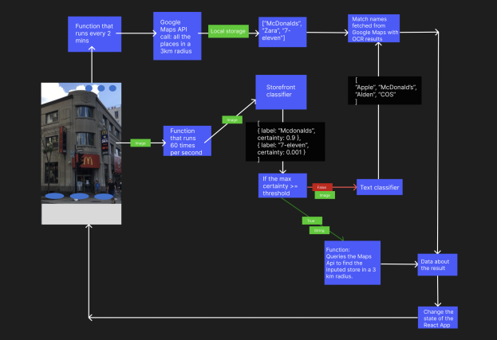
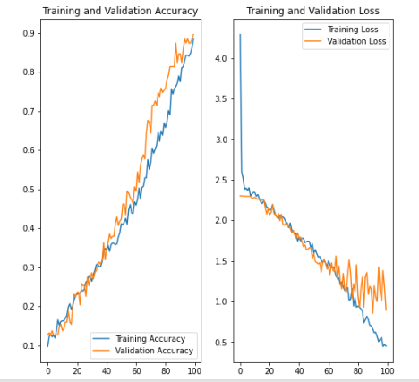

[![MIT License][license-shield]][license-url]
[![LinkedIn][linkedin-shield]][linkedin-url]

## Demo
https://user-images.githubusercontent.com/76407228/216791860-90430466-e84f-4cf2-a573-7d156b9346db.mp4

## Inspiration
Our inspiration for the project was based on augmented reality glasses, where we imagined ourselves looking at stores and automatically getting all the relevant information from them. Since we didn't have access to augmented reality glasses, we decided to use our phones to accomplish the same task.

## What it does
NearbyNow is a service that can scan storefronts such as shops, restaurants, grocery stores, and so on, using a live camera feed. The service uses two distinct methods to scan for storefronts.

The first method uses a custom-trained MobileNetV2 Deep Neural Network to predict a storefront from a trained dataset. Using a DNN allows us to train more specific elements to detect in the future such as an open/closed sign, the amount of traffic inside the store, and so on.

If the DNN yields a low prediction threshold, we use our second detection method, which is composed of two sub-steps.

Firstly, we send some of the frames of the live camera feed to be processed by our Optical Character Recognition algorithm. If a shop is detected, we go on to step two.

Secondly, we utilize the Google Maps API to cleverly match a store with our results.  based on the user's location we compare the shops nearby and output a relevant result. Once this is done, we display our findings to the front end. 

### Diagram:

## How we built it
- Created the dataset for the DNN
- Designed and custom-trained the DNN
- Created HTTP requests for the APIs
- Integrated the OCR 
- Parsed the data received from the APIs (OCR, Google Maps, Geoapify)
- Integrated the DNN and OCR into the front-end
- Compared the models prediction to nearby stores
- Queried the data needed for the given store
- Displayed the information retrieved on the front-end

### Built With

* [![tensorflow][tensorflow]][tensorflow-url]
* [![reactjs][reactjs]][reactjs-url]
* [![Python][Python]][Python-url]
* [![javascript][javascript]][javascript-url]
* [![googlecloud][googlecloud]][googlecloud-url]

## Challenges we ran into
- Creating the dataset proved to be difficult and time-consuming, as finding relevant and good pictures was challenging
- Tuning the DNN to match the required accuracy results needed
- Make sure our DNN is lightweight enough to run on a mobile device
- Making sure to detect the right store when the video was noisy or had multiple other texts
- Exporting the Tensorflow model to javascript to be used in real-time

## Accomplishments that we're proud of
- We were able to design, train and run a DNN network with good accuracies to predict stores
- Created a beautiful front end to display our results
- Achieved OCR readings from a live camera feed
- Integrated multiple APIs and combined them together to get an accurate and satisfactory result
- Used GoogleMaps API to find the nearest stores using geolocation within a radius in order to find the correct store and fetch the necessary data
-  Used String pattern matching to detect anomalies and invalid OCR readings

### Training Results:

## What we learned
Creating NearbyNow, we learned how powerful APIs can be, as well as the complexity of the task. Pattern Recognition using DNNs, live OCR readings, front-end development and creating a dataset can all be separated into individual problems that we could spend countless days improving. However, we are very proud to have accomplished what we did in 24 hours.

## What's next for NearbyNow
A lot of improvements and additions can be made to gain more accurate results and have more relevant information displayed when scanning a storefront. Eventually, we would like to add more detailed reviews of businesses, be able to detect traffic in the area and be able to recognize and display important historic buildings and monuments.

[license-shield]: https://img.shields.io/github/license/aminekabene/NearbyNow.svg?style=for-the-badge
[license-url]: https://github.com/Aminekabene/NearbyNow/blob/main/LICENSE
[linkedin-shield]: https://img.shields.io/badge/-LinkedIn-black.svg?style=for-the-badge&logo=linkedin&colorB=555
[linkedin-url]: https://www.linkedin.com/in/amine-kabene/

[tensorflow]: https://img.shields.io/badge/tensorflow-000000?style=for-the-badge&logo=tensorflow&logoColor=yellow
[tensorflow-url]: https://www.tensorflow.org/
[reactjs]: https://img.shields.io/badge/react-000000?style=for-the-badge&logo=react&logoColor=blue
[reactjs-url]: https://reactjs.org/
[Python]: https://img.shields.io/badge/Python-000000?style=for-the-badge&logo=Python&logoColor=orange
[Python-url]: https://www.python.org/
[javascript]: https://img.shields.io/badge/javascript-000000?style=for-the-badge&logo=javascript&logoColor=yellow
[javascript-url]: https://www.javascript.com/
[googlecloud]: https://img.shields.io/badge/googlecloud-000000?style=for-the-badge&logo=googlecloud&logoColor=green
[googlecloud-url]: https://cloud.google.com/
